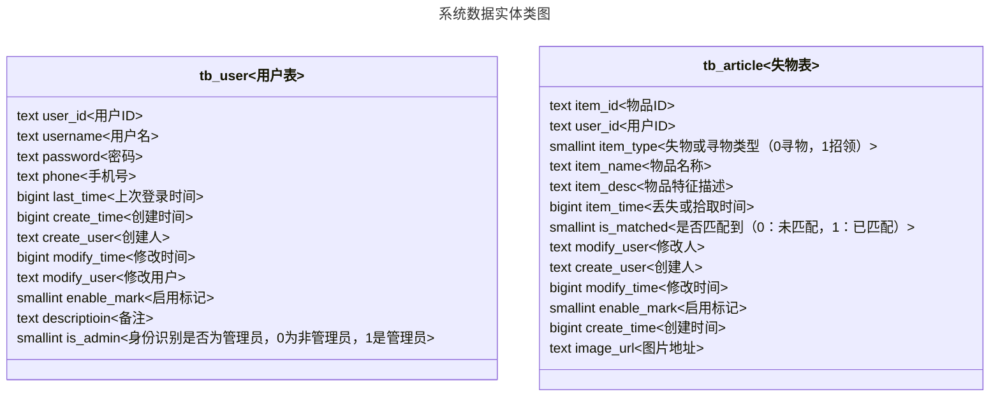

```mermaid
---
title: 系统数据实体类图
---
classDiagram
direction TB
class tb_user~用户表~{
	text user_id~用户ID~
	text username~用户名~
	text password~密码~
	text phone~手机号~
	bigint last_time~上次登录时间~
	bigint create_time~创建时间~
	text create_user~创建人~
	bigint modify_time~修改时间~
	text modify_user~修改用户~
	smallint enable_mark~启用标记~
	text descriptioin~备注~
	smallint is_admin~身份识别是否为管理员，0为非管理员，1是管理员~
}
class tb_article~失物表~{
	text item_id~物品ID~
	text user_id~用户ID~
	smallint item_type~失物或寻物类型（0寻物，1招领）~
	text item_name~物品名称~
	text item_desc~物品特征描述~
	bigint item_time~丢失或拾取时间~
	smallint is_matched~是否匹配到（0：未匹配，1：已匹配）~
	text modify_user~修改人~
	text create_user~创建人~
	bigint modify_time~修改时间~
	smallint enable_mark~启用标记~
	bigint create_time~创建时间~
	text image_url~图片地址~
}
```
